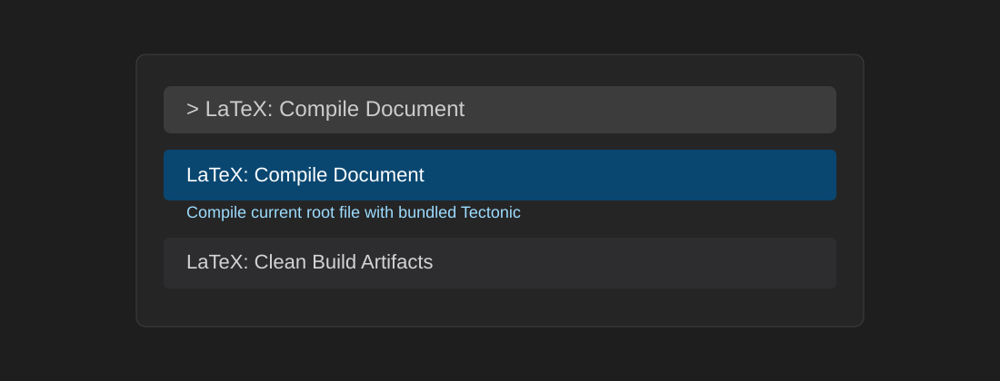
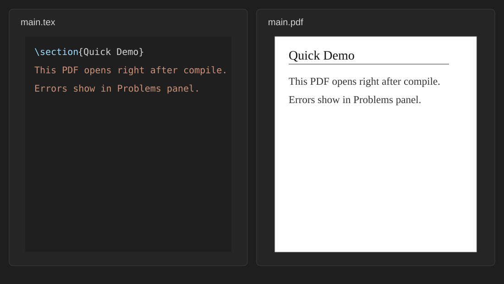
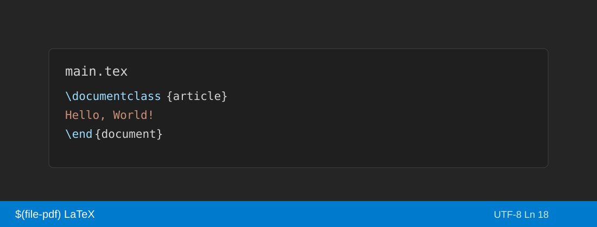

# LaTeX One-Click

[](https://github.com/Bowen-AI/Local-Latex/actions/workflows/ci.yml)
[](LICENSE)

Compile LaTeX to PDF locally in Visual Studio Code without installing a full TeX distribution (MiKTeX, TeX Live, or MacTeX).

The extension uses the [Tectonic](https://tectonic-typesetting.github.io/) engine. On first compile it provisions a verified runtime; TeX packages are retrieved on demand for your document, rather than through a multi‑gigabyte distribution installer. Builds run on your machine. The integrated PDF preview supports SyncTeX reverse search: selecting a position in the preview opens the corresponding `.tex` file and line in the editor. Diagnostics appear in the Problems panel.

**Repository:** [github.com/Bowen-AI/Local-Latex](https://github.com/Bowen-AI/Local-Latex) (open source). Issues and contributions are welcome.

## Editing with AI-assisted tools

LaTeX One-Click fits workflows in VS Code, Cursor, and similar editors where you use inline assistance or local models: you keep `.tex` sources and PDF output in the workspace (by default under `out/`), run compile from the same window, and refresh the embedded preview. The extension does not submit document content to a cloud LaTeX service; compilation is a local child process with `shell: false`. Optional auto-compile on save supports rapid iteration.

## What It Does

- Compile the resolved project with `LaTeX: Compile Document`.
- Open and refresh the PDF preview after successful builds.
- Resolve `main.tex`, `% !TEX root = ...`, or configured root for multi-file projects.
- Surface errors and warnings in the Problems panel.
- Optional auto-compile on save.
- Emit SyncTeX data (`.synctex.gz`) for PDF-to-source navigation when enabled.
- Write build artifacts to a configurable workspace-local output directory.

## Interface overview

Schematic illustrations (appearance depends on your editor theme):

**Command Palette — LaTeX commands**



**Editor — PDF preview beside source**



**Status bar — compile control**



## PDF preview and SyncTeX

With `latexOneClick.syncTeX` enabled (default), each build produces `.synctex.gz`. In the built-in preview, reverse search maps a click in the PDF to a line in the `.tex` source when SyncTeX data permits. Accuracy depends on the document and engine output; see Known limitations.

Relevant implementation: `src/preview/pdfPreview.ts` (webview and input), `src/preview/synctex.ts` (sync file handling).

In the **Errors & Warnings** sidebar, `LaTeX: Reveal Source Location` opens the source for an entry when line metadata is present (`src/sidebar/revealTexLocation.ts`).

Forward search (editor to PDF) is not a primary feature; reverse search from the preview is the supported direction.

## Why Install It

- Lightweight provisioning relative to a full TeX installation: a single Tectonic runtime, then package retrieval driven by the project.
- Integrated PDF preview with SyncTeX navigation from the PDF to the corresponding source.
- No third-party cloud compilation or project upload required.
- Single-command build from `.tex` to PDF, with compile and preview available from the sidebar.

## Trust, Openness, and Privacy

This project is open source: <https://github.com/Bowen-AI/Local-Latex>

The extension is designed to be inspectable and conservative:

- No telemetry is collected.
- Compilation runs locally in a child process with `shell: false`.
- Compile, clean, preview, and root-selection commands require a trusted workspace.
- Output directories are restricted to safe workspace-local paths.
- The Tectonic binary is downloaded from official GitHub Releases and verified with SHA-256 checksums before use.
- Downloaded runtime archives are removed after extraction.
- No secrets, tokens, or credentials are stored or used.

Network behavior is intentionally limited and documented:

- On first compile, the extension downloads the Tectonic binary from official GitHub Releases.
- During compilation, Tectonic may also download missing TeX packages.
- Set `latexOneClick.offlineOnly` to `true` to force cached-only package use after the needed packages are already available.

See [docs/security.md](docs/security.md) for the detailed security model.

## Source layout

| Area | Path |
|------|------|
| Extension entry and activation | `src/extension.ts` |
| Compile command and progress | `src/commands/compile.ts` |
| Tectonic CLI arguments | `src/core/compiler.ts` |
| Main `.tex` resolution | `src/core/mainFileResolver.ts` |
| PDF webview and reverse search | `src/preview/pdfPreview.ts` |
| SyncTeX parsing | `src/preview/synctex.ts` |
| Tectonic runtime download | `src/runtime/runtimeManager.ts` |

Clone the repository, run `npm ci` and `npm run compile`, then launch **Run Extension** (F5) in VS Code for local development.

## Quick Start

1. Install the extension.
2. Open a trusted folder containing a `.tex` file. Mixed-case extensions such as `.TEX` and `.TeX` are recognized.
3. Run `LaTeX: Compile Document` from the Command Palette, the status bar, or the extension sidebar.
4. The generated PDF opens beside your editor.

The first compile may take longer while the runtime and any missing packages are retrieved. Subsequent builds typically use the cache and are faster.

## First Compile Example

Create `main.tex`:

```latex
\documentclass{article}
\begin{document}
Hello, World!
\end{document}
```

Open the folder in VS Code and run `LaTeX: Compile Document`. The extension will resolve the main file, ensure Tectonic is available, compile locally, and open `out/main.pdf`.

### Sample workspace in this repository

For a ready-made project (multi-file `main.tex` plus `sections/findings.tex` with `% !TEX root`), open **[`examples/demo-paper/`](examples/demo-paper/)** in VS Code and follow **[`examples/demo-paper/README.md`](examples/demo-paper/README.md)**. It is the same path used for manual QA and extension-host checks.

## Main Commands

| Command | What it does |
|---------|--------------|
| `LaTeX: Compile Document` | Builds the active/resolved LaTeX document |
| `LaTeX: Open PDF Preview` | Opens the last generated PDF |
| `LaTeX: Select Root File` | Sets the project main `.tex` file |
| `LaTeX: Clean Build Artifacts` | Removes workspace-local build outputs |
| `LaTeX: Doctor` | Reports runtime, workspace, settings, and output-directory health |
| `LaTeX: Reveal Source Location` | Opens the `.tex` source for a sidebar diagnostic (when line info is available) |

The activity-bar sidebar keeps `Compile document` and `Open PDF preview` at the top level. Root selection, output directory, toggles, clean, and Doctor are grouped under `Advanced`.

## Settings

| Setting | Type | Default | Description |
|---------|------|---------|-------------|
| `latexOneClick.autoCompileOnSave` | boolean | `false` | Compile automatically on save |
| `latexOneClick.compileDebounceMs` | number | `1000` | Debounce delay for auto-compile in ms |
| `latexOneClick.mainFile` | string | `""` | Main LaTeX file to compile |
| `latexOneClick.outputDirectory` | string | `"out"` | Output directory for compiled files |
| `latexOneClick.offlineOnly` | boolean | `false` | Use only cached packages |
| `latexOneClick.compileTimeoutSec` | number | `60` | Compile timeout in seconds |
| `latexOneClick.preview.autoOpen` | boolean | `true` | Auto-open PDF after compile |
| `latexOneClick.preview.preserveFocus` | boolean | `true` | Keep editor focus when PDF opens |
| `latexOneClick.syncTeX` | boolean | `true` | Generate SyncTeX metadata (`.synctex.gz`) on compile |
| `latexOneClick.tectonicPrint` | boolean | `false` | Pass `--print` to Tectonic for fuller engine/BibTeX output in the output channel |
| `latexOneClick.tectonicKeepLogs` | boolean | `false` | Pass `--keep-logs` to Tectonic to keep intermediate logs under the output directory |

Compile and clean actions refuse filesystem roots, the home directory, the workspace root, symlinked paths outside the workspace, and output directories outside the current workspace.

## Multi-File Projects

For projects with multiple `.tex` files, add this directive to chapter files:

```latex
% !TEX root = ../main.tex
```

You can also run `LaTeX: Select Root File` to choose the main file interactively.

## Known Limitations

- Tectonic uses an XeTeX-oriented pipeline; pdfLaTeX-specific packages or workflows may require adaptation.
- Linux arm64 and Windows arm64 are not supported.
- The `Tectonic.toml` project format is not supported.
- SyncTeX reverse search from the PDF depends on engine output and mapping quality; results are not guaranteed in all documents.

## Troubleshooting

Run `LaTeX: Doctor` first. It reports:

- supported platform status,
- runtime path and readiness,
- trusted workspace status,
- configured and resolved main file,
- configured and resolved output directory,
- key compile and preview settings.

For common issues, see [docs/troubleshooting.md](docs/troubleshooting.md).

## Testing and CI

- **Continuous integration:** [GitHub Actions](https://github.com/Bowen-AI/Local-Latex/actions) runs lint, typecheck, unit tests, compile, smoke packaging checks, and VSIX packaging on **Ubuntu** and **macOS** (see `.github/workflows/ci.yml`).
- **Tests:** `npm test` runs Vitest suites under `src/test/unit/` and `src/test/e2e/` (compile pipeline and preview-state coverage among others).
- **`npm run smoke`:** validates required build outputs, `package.json` activation metadata, and the runtime manifest shape.
- **`npm run package:check`:** allowlist/blocklist gate for marketplace contents and release metadata.
- **`npm run test:extension`:** optional extension-host smoke when the `code` CLI is available (see [docs/release.md](docs/release.md)).

Security and data-handling detail: [docs/security.md](docs/security.md).

## Development

```bash
npm ci
npm run compile
npm test
npm run smoke
npm run test:extension
npm run package:check
```

- `npm test`: unit and e2e-style tests.
- `npm run smoke`: quick artifact and metadata sanity check.
- `npm run test:extension`: VS Code extension-host smoke test for command registration, Doctor, PDF preview readiness, sidebar shape, and Clean.
- `npm run package:check`: validates marketplace package contents, runtime manifest, activation events, and published settings.

For release details, see [docs/release.md](docs/release.md).

## Website

Documentation site (Jekyll): **[https://bowen-ai.github.io/Local-Latex/](https://bowen-ai.github.io/Local-Latex/)** — source in [`website/`](website/), built by [`.github/workflows/pages.yml`](.github/workflows/pages.yml).
