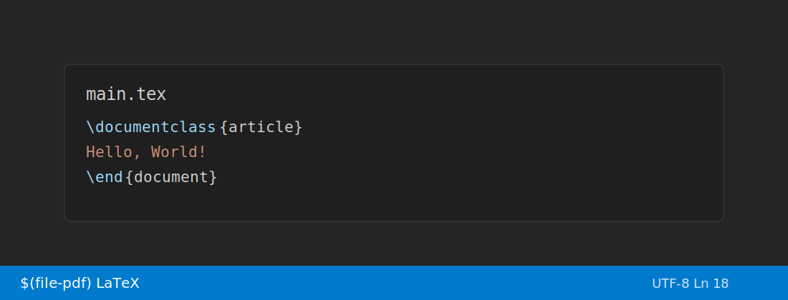
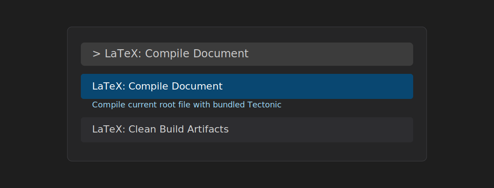
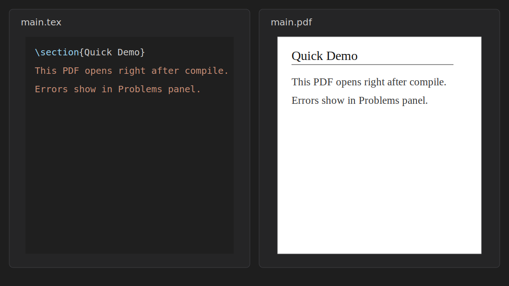

## Compile LaTeX to PDF with one click

LaTeX One-Click is a VS Code extension that bundles the Tectonic engine so you can compile `.tex` files without installing TeX Live or MiKTeX.

> Short answer: **yes** — a project website can improve SEO if it has useful content, clear metadata, and internal/external links. This page is structured for that.

### Personal profile

- Learn more about the maintainer: [Bowen profile](https://bowenislandsong.github.io/#/personal)

### Feature highlights

- One-click compilation from the status bar
- Bundled runtime (no external TeX install required)
- PDF preview after successful build
- SyncTeX output for source mapping workflows
- Diagnostics in the VS Code Problems panel
- Multi-file root file support

## GUI walkthrough (with picture views)

### 1) Status bar compile action



### 2) Command palette flow



### 3) Side-by-side PDF preview



## Usage examples

### Example 1: Minimal document

```latex
\documentclass{article}
\begin{document}
Hello from LaTeX One-Click!
\end{document}
```

Compile with **LaTeX: Compile Document** and view the generated PDF in VS Code.

### Example 2: Multi-file project root

In `chapters/ch1.tex`:

```latex
% !TEX root = ../main.tex
\chapter{Introduction}
```

The extension compiles `main.tex` while editing chapter files.

## How to maximize SEO for this project site

1. Keep this page updated with practical examples and screenshots.
2. Publish release notes and changelog links on each release.
3. Add backlinks from README, marketplace pages, and social profiles.
4. Use descriptive headings (`H2/H3`) and keyword-rich alt text for images.
5. Keep load time fast (lightweight images, static pages, clean markup).

## Documentation

- [README](../README.md)
- [Architecture](../docs/architecture.md)
- [Troubleshooting](../docs/troubleshooting.md)
- [Release Process](../docs/release.md)
