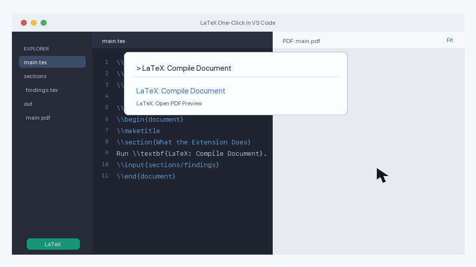

<section class="hero">
  

  

    
VS Code extension for local LaTeX

    <h1>LaTeX One-Click</h1>
    
Compile, preview, and jump from PDF output back to source without leaving VS Code.

    

      <a class="btn btn-primary" href="https://github.com/Bowen-AI/Local-Latex">View repository</a>
      <a class="btn btn-ghost" href="#demo">Watch workflow</a>
    

  

  

    Compile
    Preview
    Click to source
  

</section>

<section class="section intro-band">
  

    
Built for usable LaTeX projects

    <h2>Local builds with a preview loop that feels native.</h2>
  

  
LaTeX One-Click provisions Tectonic, resolves the right root file, compiles into a clean output directory, opens a right-side PDF panel, and uses SyncTeX to move from PDF clicks back to source lines.

</section>

<section id="demo" class="section demo-section">
  

    
Example usage

    <h2>Compile a demo paper, inspect the PDF, click back into code.</h2>
  

  <figure class="demo-frame">
    
    <figcaption>Animated demo of the new extension-owned PDF preview and SyncTeX reverse navigation.</figcaption>
  </figure>
</section>

<section class="section workflow">
  

    01
    <h3>Compile locally</h3>
    
Run <code>LaTeX: Compile Document</code>. The extension downloads the pinned Tectonic runtime when needed and creates the configured output folder.

  

  

    02
    <h3>Preview on the right</h3>
    
The generated PDF opens in a dedicated VS Code webview with zoom, fit-width, page rendering, and preserved preview state.

  

  

    03
    <h3>Jump to source</h3>
    
Click text in the PDF preview. SyncTeX lookup opens the nearest source file and reveals the source line.

  

</section>

<section class="section feature-grid">
  

    <h3>Bundled runtime</h3>
    
Tectonic is pinned, checksummed, and provisioned by the extension instead of relying on a separate TeX install.

  

  

    <h3>Project-aware roots</h3>
    
Supports settings, <code>main.tex</code>, nested roots, active editors, and <code>% !TEX root</code> directives.

  

  

    <h3>Problems panel output</h3>
    
Compiler logs are parsed into diagnostics so errors and warnings land where VS Code users expect them.

  

  

    <h3>Demo workspace included</h3>
    
Open <code>examples/demo-paper</code> to try a multi-file document with interactive preview navigation.

  

</section>

<section class="section quickstart">
  

    
Developer quick start

    <h2>Run the extension locally.</h2>
    
Use the included VS Code launch config, then open the demo paper and run the compile command.

  

  

<pre><code>npm ci
npm run compile
# VS Code: Run Extension
# Open examples/demo-paper
# Run "LaTeX: Compile Document"</code></pre>
  

</section>

<section class="section docs-row">
  <a href="https://github.com/Bowen-AI/Local-Latex/blob/main/docs/architecture.md">Architecture</a>
  <a href="https://github.com/Bowen-AI/Local-Latex/blob/main/docs/compatibility.md">Compatibility</a>
  <a href="https://github.com/Bowen-AI/Local-Latex/blob/main/docs/security.md">Security</a>
  <a href="https://github.com/Bowen-AI/Local-Latex/blob/main/docs/troubleshooting.md">Troubleshooting</a>
  <a href="https://github.com/Bowen-AI/Local-Latex/blob/main/docs/release.md">Release process</a>
</section>
