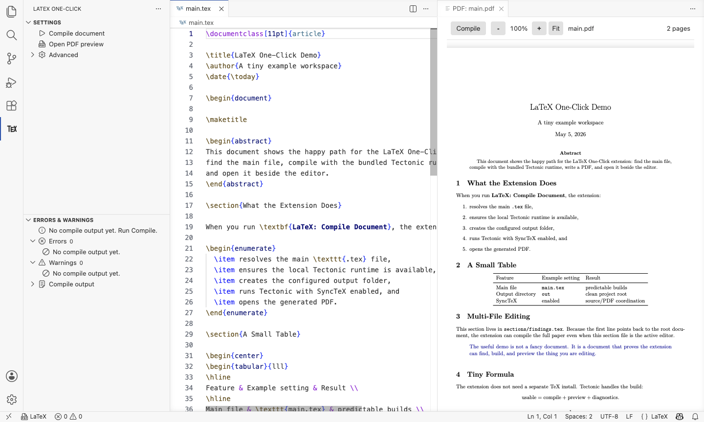
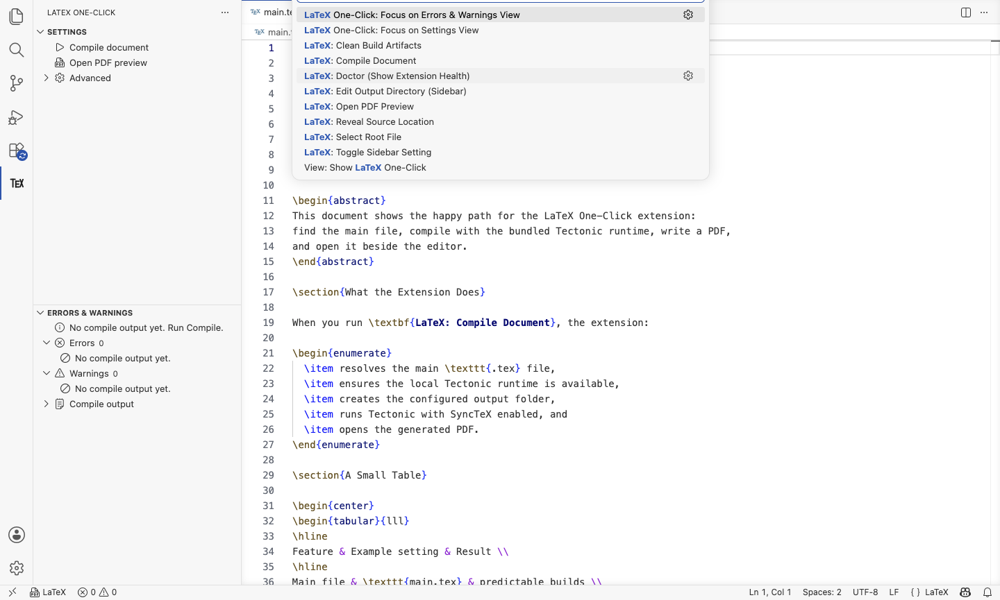
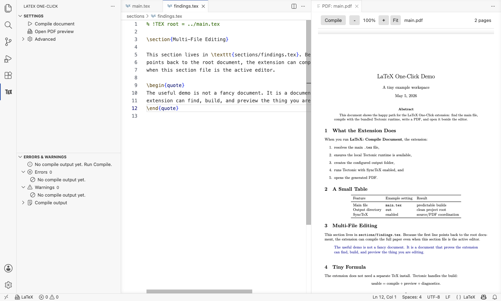

<section class="hero">
  

  

    
VS Code extension for local LaTeX

    <h1>LaTeX One-Click</h1>
    
Skip MacTeX, TeX Live, and MiKTeX setup. Install the add-on, compile your PDF, then click the preview to jump back to the source line you need to edit.

    

      <a class="btn btn-primary" href="https://marketplace.visualstudio.com/items?itemName=BowenAI.latex-one-click">VS Code Marketplace</a>
      <a class="btn btn-ghost" href="https://open-vsx.org/extension/BowenAI/latex-one-click">Open VSX</a>
      <a class="btn btn-ghost" href="https://github.com/Bowen-AI/Local-Latex">Repository</a>
    

  

  

    No TeX distribution
    One-command compile
    PDF click to source
  

</section>

<section class="section intro-band">
  

    
The setup-free LaTeX loop

    <h2>Install the extension instead of a full TeX distribution.</h2>
  

  
LaTeX One-Click provisions Tectonic, resolves the right root file, compiles into a clean output directory, opens a PDF panel, and uses SyncTeX to move from PDF clicks back to the source lines you want to edit.

</section>

<section id="demo" class="section demo-section">
  

    
Real VS Code capture

    <h2>No TeX install. Compile a PDF. Click back into code.</h2>
  

  <figure class="demo-frame">
    
    <figcaption>Captured from the extension running in VS Code: source on the left, compiled PDF preview on the right.</figcaption>
  </figure>
</section>

<section class="section screenshots">
  <figure>
    
    <figcaption>Command Palette compile</figcaption>
  </figure>
  <figure>
    
    <figcaption>PDF beside source</figcaption>
  </figure>
  <figure>
    
    <figcaption>Click back to code</figcaption>
  </figure>
</section>

<section class="section workflow">
  

    01
    <h3>Install the add-on</h3>
    
Skip MacTeX, TeX Live, and MiKTeX. The extension manages the Tectonic runtime for you.

  

  

    02
    <h3>Compile locally</h3>
    
Run <code>LaTeX: Compile Document</code>. The extension resolves the root file and builds the PDF from VS Code.

  

  

    03
    <h3>Click PDF text</h3>
    
The integrated preview opens beside your source. Click rendered output to trace it back to LaTeX.

  

  

    04
    <h3>Edit exact code</h3>
    
SyncTeX reverse search reveals the matching source line, so you can revise the code that produced the PDF text.

  

</section>

<section class="section feature-grid">
  

    <h3>Bundled runtime</h3>
    
Tectonic is pinned, checksummed, and provisioned by the extension instead of relying on a separate TeX install.

  

  

    <h3>Project-aware roots</h3>
    
Supports settings, <code>main.tex</code>, nested roots, active editors, and <code>% !TEX root</code> directives.

  

  

    <h3>Problems panel output</h3>
    
Compiler logs are parsed into diagnostics so errors and warnings land where VS Code users expect them.

  

  

    <h3>Demo workspace included</h3>
    
Open <code>examples/demo-paper</code> to try a multi-file document with interactive preview navigation.

  

</section>

<section class="section quickstart">
  

    
Developer quick start

    <h2>Run the extension locally.</h2>
    
Use the included VS Code launch config, then open the demo paper and run the compile command.

  

  

<pre><code>npm ci
npm run compile
# VS Code: Run Extension
# Open examples/demo-paper
# Run "LaTeX: Compile Document"</code></pre>
  

</section>

<section class="section docs-row">
  <a href="https://github.com/Bowen-AI/Local-Latex/blob/main/docs/architecture.md">Architecture</a>
  <a href="https://github.com/Bowen-AI/Local-Latex/blob/main/docs/compatibility.md">Compatibility</a>
  <a href="https://github.com/Bowen-AI/Local-Latex/blob/main/docs/security.md">Security</a>
  <a href="https://github.com/Bowen-AI/Local-Latex/blob/main/docs/troubleshooting.md">Troubleshooting</a>
  <a href="https://github.com/Bowen-AI/Local-Latex/blob/main/docs/release.md">Release process</a>
</section>
